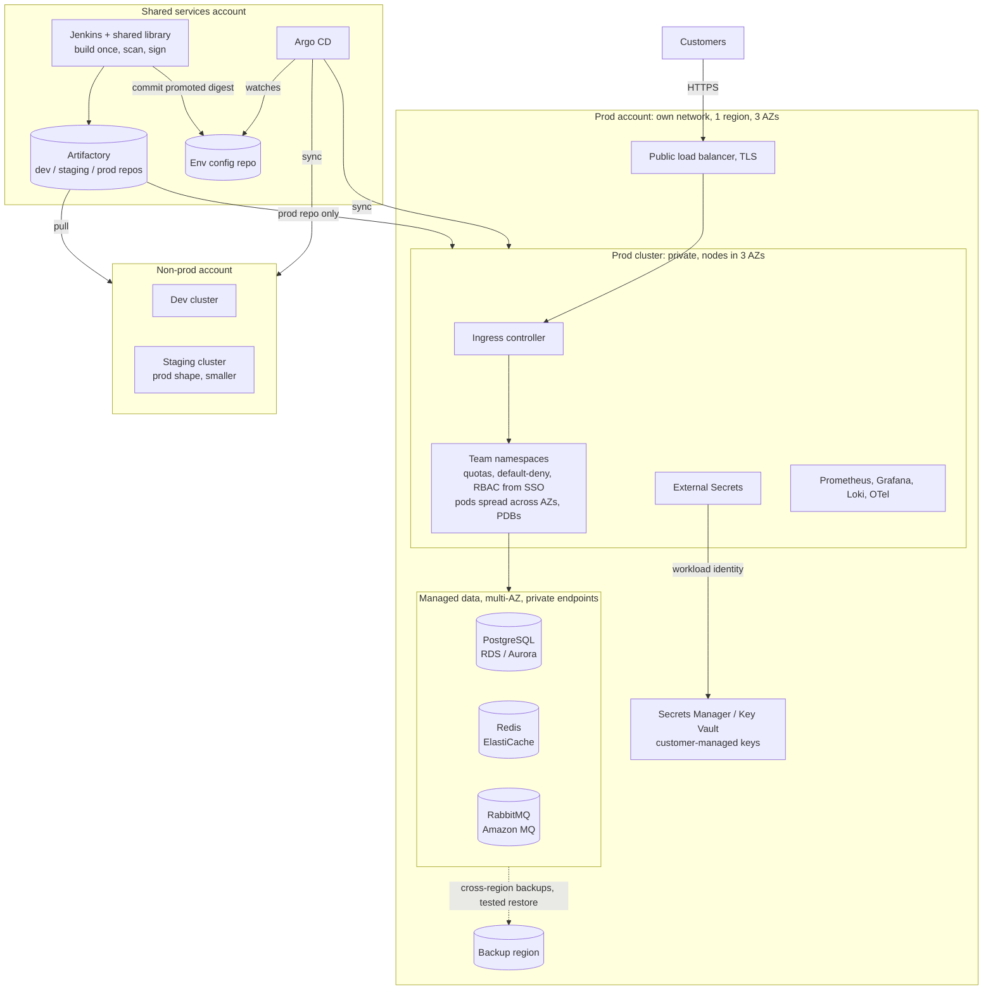

# hello-platform

Deploying an existing container (podinfo) to Kubernetes with Terraform, Helm and a Jenkins
pipeline. The image is imported once into our own registry, then the same digest is promoted
from dev to prod, the way I'd do it with Artifactory.

Everything runs locally on kinD, so you can reproduce it with Docker and a few CLIs. No cloud
account and no secrets needed.

```bash
make up         # kind cluster + local registry, traefik, metrics-server, dev/prod namespaces
make release    # import + scan + push, deploy dev, confirm, promote, deploy prod
curl http://podinfo.localtest.me:8080/
make down
```

Needs Docker (about 4 GB RAM is enough), Terraform >= 1.6, Helm 3 or 4, kubectl, curl.
trivy is used if installed. `localtest.me` resolves to 127.0.0.1,
so no /etc/hosts changes.

First run: `upstream/podinfo.env` has `UPSTREAM_DIGEST` empty. `make release` prints the
digest, commit it. On main the pipeline refuses to import an unpinned image.

## Layout

```
upstream/podinfo.env        which upstream image/version/digest we ship (a release = PR on this file)
deploy/helm/podinfo/        our chart for podinfo
deploy/environments/        dev and prod values (only what differs)
infra/terraform/
  modules/app-namespace/    reusable: namespace + quota + network baseline + CI deployer
  cluster/                  kind + local registry
  platform/                 traefik, metrics-server
  envs/dev, envs/prod       environment-specific, one state each
scripts/                    import-image.sh, promote.sh, deploy.sh (used by make and Jenkins)
Jenkinsfile
```

## Infrastructure (Terraform)

The reusable part is `modules/app-namespace`. It has no idea which environment it is in.
`envs/dev` and `envs/prod` call it with their own quota, and each has its own state, so a plan
in dev can't touch prod. I used folders and not workspaces because with workspaces the
environment isn't visible in the code and a wrong `workspace select` hits the wrong env.

`cluster` and `platform` are separate roots on purpose: the helm provider needs a running
cluster, and configuring a provider from a resource created in the same apply tends to break.

Versions are pinned: providers, chart versions, and the kind node image by digest. State is
local for this demo. For a production-grade setup it would be a remote backend with locking and
encryption (e.g. S3 or Azure Storage), one state per root.

Terraform owns the cluster, add-ons, namespaces, quotas, network policies and RBAC. Helm
(from the pipeline) owns the app. Nothing is managed by both.

## Application deployment

podinfo is a small Go service with `/healthz`, `/readyz` and Prometheus metrics, which is all
I needed, I deploy it with my own chart.

- Probes: startup probe for slow starts, liveness on `/healthz`, readiness on `/readyz`.
  Liveness should never check the database: if the DB blips, every pod restarts at once.
- Rollouts: `maxUnavailable: 0` and a 5 sec preStop sleep, so traefik stops sending traffic to
  a pod before it shuts down.
- Availability in prod: at least 3 replicas, HPA on CPU (3-10), PDB `maxUnavailable: 1`.
  Dev is a single replica with no PDB.
- Resources: requests and a memory limit, no CPU limit. CPU limits cause throttling that looks
  like latency even when average CPU is low (relevant to the scenario below).
- Exposure: ClusterIP service behind a traefik Ingress. The quota allows no LoadBalancer or
  NodePort services, so the ingress is the only way in.

## CI/CD

```
make validate -> import + scan + push to dev repo -> deploy dev + smoke test
   -> approval -> promote same digest to prod repo -> deploy prod + smoke test
```

The Jenkinsfile only orchestrates. The logic is in `scripts/`, so `make release` runs exactly
the same steps on a laptop. Every branch gets checks, import and scan. Only main deploys.

Promotion: We don't build podinfo, so the first step is an import: pull the upstream
image by its pinned digest, scan it with trivy (fail on fixable HIGH/CRITICAL), push it to
`localhost:5001/dev/podinfo` and record the digest. Promotion copies that image to the prod
repo and checks the digest didn't change. Every deploy uses `repo@sha256:...`, never a tag.
Why import instead of pulling from ghcr.io directly: prod doesn't depend on ghcr.io being up,
nobody can change what we run by moving a tag\release upstream, and everything that runs was scanned.
With Artifactory Pro `promote.sh` would be one call to the promote API.

The smoke test goes through the ingress and checks that podinfo reports the version we just
deployed. That catches "helm says success but traffic still hits the old pods".

Rollback:
- Bad version never gets Ready: helm `--rollback-on-failure` puts the
  previous release back automatically.
- Bad version found later: run the job with `ROLLBACK_DIGEST=sha256:...`, which redeploys an
  older image that is already in the prod repo. From a terminal: `make rollback` (previous helm
  revision) or `make rollback DIGEST=sha256:...`.
- In a real system the hard part is the database. Migrations have to be backward compatible
  (expand, deploy, contract) so the old version still works after a rollback.

## Security

No credentials in the repo. `.gitignore` covers state, kubeconfigs and `.env` files.

Identities:
- Jenkins keeps the registry token and one kubeconfig per environment in its credential store,
  injected with `withCredentials` only in the stages that need them.
- Each namespace has its own `ci-deployer` ServiceAccount (created by Terraform) that can manage
  only the app's object types in that namespace. It has no RBAC rights, so it can't escalate.
  Its kubeconfig uses a short-lived token: `kubectl -n podinfo-prod create token ci-deployer --duration=1h`.
- The app has no service account token mounted. It doesn't need the API.
- In production I'd remove static credentials completely: workload identity (IAM roles /
  Entra ID via OIDC) for the Jenkins agents and the pods, secrets in Secrets Manager or Key Vault
  synced by External Secrets Operator, and SSO + group-based RBAC for people.

Hardening in place: Pod Security `restricted` on the namespaces, non-root numeric UID,
read-only root filesystem, all capabilities dropped, seccomp RuntimeDefault, default-deny
NetworkPolicy with DNS and traefik as the only exceptions, quota per namespace, registry and
ingress bound to 127.0.0.1.

Risks I considered:
1. A leaked CI credential deploys to prod. Mitigated by one deployer per namespace, short-lived
   tokens, and prod behind an approval. Real fix: workload identity, so there's nothing to leak.
2. A vulnerable or tampered third-party image. Mitigated by pinning upstream by digest, importing
   into our registry, the trivy gate, and promoting only what was tested. When the scan blocks
   an image we don't build, the fix is a newer upstream version, or a reviewed exception with an
   expiry date in `upstream/.trivyignore` (that happened on my first run, see the file). Next step: cosign
   signatures plus an admission policy (Kyverno) that only allows signed images from the prod repo.
3. A compromised pod moving sideways. Default-deny network policy (ingress\egress blocked by default), 
   no API token (app doesn't talk to the k8s API), non-root UID, read-only filesystem.
4. Secrets in Git or in Terraform state. State is never committed and would live in an encrypted
   backend with restricted access.
5. Jenkins itself. It can deploy everywhere, so in production: ephemeral pod agents, no
   docker.sock, folder-level permissions, SSO.

## Monitoring

Using Prometheus (which is not pert of this repo). I'd monitor it as follows:

- Prometheus scrapes podinfo's `/metrics` (`http_requests_total`, `http_request_duration_seconds`).
- Alerts on what users feel, not on CPU: p95 latency above 1 sec for 10 min, 5xx ratio (HTTP 5xx error codes) 
  above 2% for 5 min, available replicas below desired for 10 min.
- Logs to CloudWatch (or similar) tracing once there are more services, and later SLO
  burn-rate alerts instead of fixed thresholds.

### Latency went from 200 ms to 5 s, everything is green

Two things stand out. Low CPU with high latency means requests are waiting, not working. And
5 seconds is the default Linux DNS resolver timeout, so DNS is my first suspect. Also, "Ready"
only means `/readyz` answers. It doesn't touch the slow path.

1. Scope it first. All endpoints or one? All pods or some (same node)? p50 or only p99? When
   exactly did it start, and what changed then? No deployment doesn't mean no change: config,
   certs, node upgrades, a DB maintenance window, traffic.
2. Find which layer adds the time, outside in:
   ```bash
   kubectl -n podinfo-prod exec deploy/podinfo -- wget -qO- http://localhost:9898/ # inside the pod
   curl -s -o /dev/null -w '%{time_namelookup} dns %{time_total} total\n' http://podinfo.localtest.me:8080/
   ```
   Fast inside the pod but slow through the ingress points to network/ingress. Slow inside points
   to the app or its dependencies.
3. Check, in this order:
   - DNS: time `nslookup` from a debug container (`kubectl debug -it <pod> --image=nicolaka/netshoot --profile=restricted`),
     CoreDNS logs and load, `conntrack -S` on the node (insert_failed is the classic 5 sec DNS bug), `ndots:5`.
   - Dependencies: Postgres `pg_stat_activity` for locks and slow queries, connection pool usage,
     Redis `SLOWLOG`, external APIs.
   - Pool saturation: requests queue for a worker or connection while CPU stays flat.
   - CPU throttling: `container_cpu_cfs_throttled_periods_total`, averages hide it.
   - One bad node or zone: latency by pod, `kubectl top nodes`, `kubectl describe node`.
4. Mitigate while investigating if users are hurting: cordon/drain a bad node, scale out, kill a
   blocking query or fail over the DB, scale CoreDNS, turn off a failing integration, revert
   whatever changed.
5. Afterwards: postmortem, a latency alert that fires before users notice, timeouts and circuit
   breakers on outbound calls, NodeLocal DNSCache if DNS was it, tracing.

## Production architecture (30 services)



- One cluster per environment, prod in its own account and network. With sensitive customer
  data, prod access and audit have to be separate. Staging has the same shape as prod, smaller.
- 99.9% (about 43 min a month) is doable in one region with 3 availability zones if every layer
  is zone-redundant: pods spread across zones, PDBs, multi-AZ database and cache.
  Multi-region would roughly double cost and complexity for a target that doesn't need it.
  Instead: cross-region backups and a restore that is actually tested.
- Managed PostgreSQL and Redis (RDS/Aurora, ElastiCache, or the Azure equivalents). Running
  databases on Kubernetes is a job of its own. RabbitMQ: Amazon MQ, or the RabbitMQ operator
  in-cluster on Azure.
- 500 requests/sec is not the hard part, it's about 17 req/s per service. Team isolation, safe delivery
  and data protection are.
- Teams: a namespace per team per environment (the `app-namespace` module), quotas, default-deny,
  RBAC from SSO groups, CODEOWNERS. Everyone uses a shared chart and a Jenkins shared library, so
  probes, security settings and alerts come for free.
- Delivery: keep build once / promote by digest in Artifactory, but at 30 services x 3 envs move
  the deploy step to Argo CD. Jenkins commits the promoted digest to an env repo and Argo CD
  applies it. Jenkins then has no cluster credentials, and drift is visible.
- Security for customer data: private cluster and private endpoints, TLS everywhere,
  encryption at rest with customer-managed keys, workload identity, signed images, audit logs,
  least-privilege DB users per service.

## Assumptions

- kind is an acceptable environment. The layout maps to a cloud: swap `cluster/` for an EKS (or
  AKS) root, and the namespaces become clusters.
- The local registry substitutes Artifactory (one repo per env). Promotion is pull/tag/push
  with a digest check because the Artifactory promote API needs Pro license.
- Prod needs a human approval (regulated, sensitive data).
- podinfo has no database, so its readiness only reflects the process. A real service would
  check its critical dependencies there.

## Trade-offs

- kind instead of a real cloud: anyone can run it, but there's no cloud LB or IAM in the code.
- One cluster, two namespaces instead of separate clusters: laptop resources. Weaker isolation.
- Two environments here (dev, prod). Staging would be a copy of `envs/prod` with smaller numbers
  and one more promote step. Left out to keep the demo light.
- Jenkins pushes with Helm instead of GitOps: fewer moving parts and I can debug every piece.
  Jenkins holds cluster credentials and drift isn't detected. Argo CD is the next step.
- CPU-based HPA instead of latency/queue-based (KEDA): simple, good enough at this load.
- Traefik instead of ingress-nginx: ingress-nginx was retired in March 2026.

## How I approached it

I asked myself what I'd need to trust this in production and worked back from that: 
a reproducible environment, one artifact moving through every stage, a deploy that can't leave a
broken version running, and a way to know when end-users are being affected.

I built CI/CD on Jenkins and the Artifactory promotion model because that's where I have the
most production experience. On the Kubernetes side I stuck to standard pieces (Deployment,
probes, HPA, PDB, NetworkPolicy, Helm) and left out tools I couldn't justify for this scope.

I put some extras (Prometheus, staging env, rollback pipelines) to the below section (more time).

## With more time

1. Argo CD for deployments, Jenkins only builds/scans/promotes.
2. A real EKS environment (with IAM roles, Secret manager, etc.)
3. Monitoring as described above, with alerts.
4. A Terraform plan/apply pipeline (plan on PR, apply the saved plan after approval).
5. Staging with automated analysis on latency and errors.
6. TLS with cert-manager, Gateway API instead of Ingress.

## Known issues

- `UPSTREAM_DIGEST` and the `.terraform.lock.hcl` files get committed after the first run.
- I tested the scripts through `make`. The Jenkinsfile calls the same scripts, but I didn't run
  it on a live Jenkins for this.
- Both environments share one cluster, so a cluster-wide problem hits both.

## Use of AI

I used Claude to help draft parts of the chart, Terraform and this README, to check API changes 
(ingress-nginx retirement), and to review the design.
The decisions are mine. I ran `make validate`, `make up` and `make release` on my machine (MacOS) and
can explain every file in the repo.
